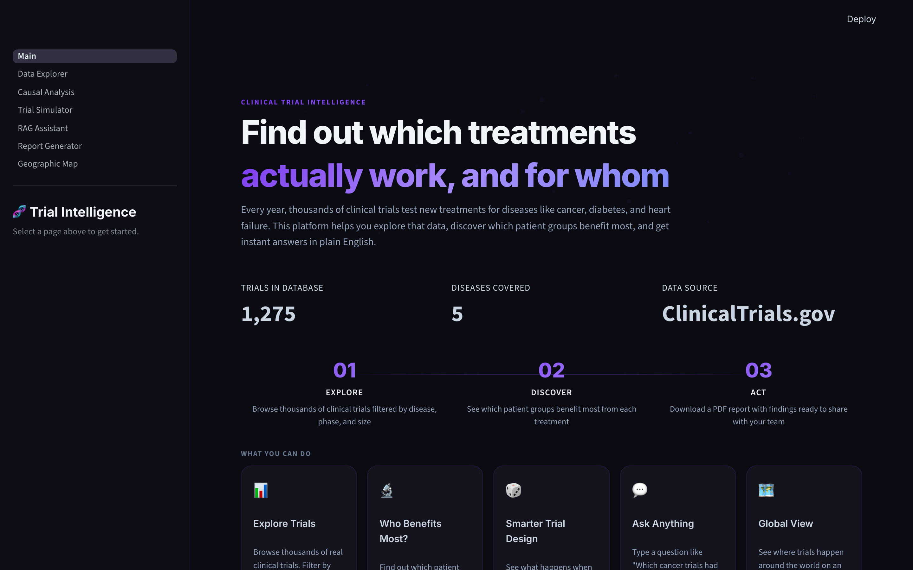
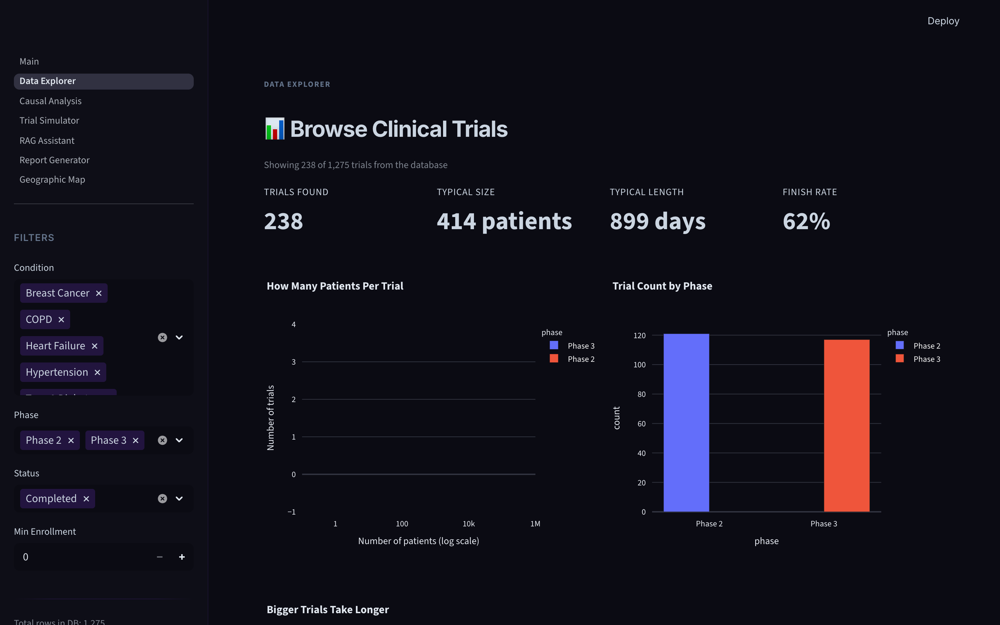
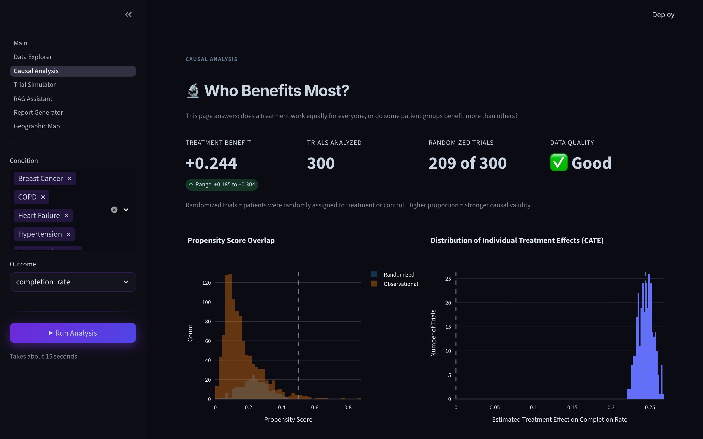
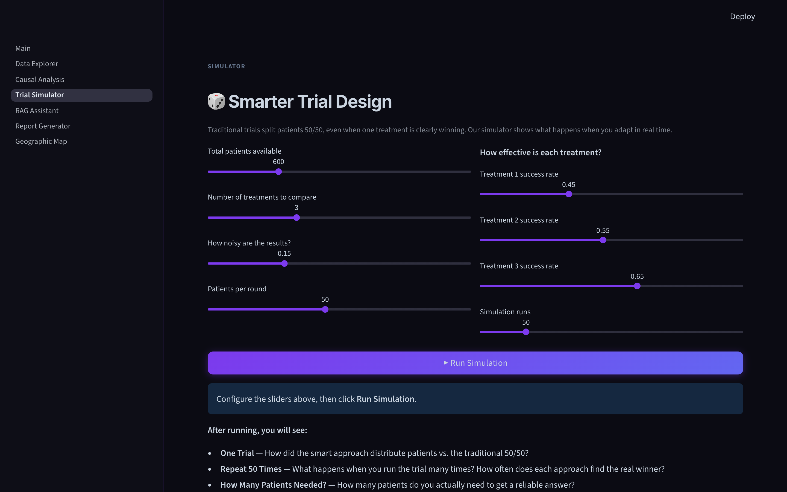
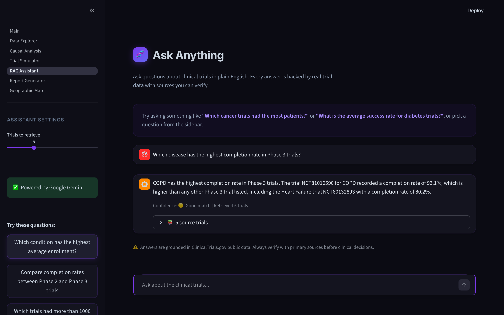
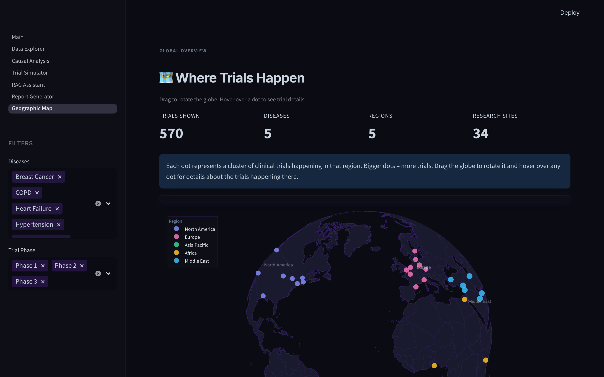

# Clinical Trial Intelligence Platform

Every year thousands of clinical trials run worldwide, but figuring out which treatments actually work and for which patients is buried in messy data. This platform pulls trial records from ClinicalTrials.gov, runs causal inference to estimate treatment effects across patient subgroups, and lets you ask questions about the data in plain English.

| | |
|---|---|
|  |  |
|  |  |
|  |  |

## What it does

- **Browse trials** - filter by disease, phase, status. See enrollment distributions and timelines.
- **Causal analysis** - fits an EconML causal forest to estimate who benefits most from treatment, not just the average effect.
- **Adaptive simulator** - compares Thompson Sampling (patients get routed to the winning arm as data comes in) against traditional 50/50 allocation.
- **Q&A** - type a question, get an answer grounded in the indexed trial data. Uses FAISS for retrieval and Gemini or Claude for generation.
- **Reports** - export your analysis as a PDF report.
- **Global map** - 3D globe showing where trials are happening by region.

## How it works

```
ClinicalTrials.gov API --+
                         +--> DuckDB --> EconML CausalForestDML --> Subgroup effects
Demo CSV (300 trials) ---+       |
                                 +--> Thompson Sampling --> Adaptive vs fixed allocation
                                 |
                                 +--> FAISS + Gemini/Claude --> Q&A with sources
                                                                     |
                                                         Jinja2 + fpdf2 --> PDF report
```

Data comes in from the ClinicalTrials.gov public API (or a bundled demo CSV). It gets stored in DuckDB, validated, then fed into three independent pipelines: causal inference, trial simulation, and retrieval-augmented Q&A.

## Tech stack

| What | How |
|------|-----|
| Storage | DuckDB (embedded, no server) |
| Causal inference | EconML CausalForestDML + SHAP for feature importance |
| Simulation | Thompson sampling with Beta-Bernoulli updates |
| Search + Q&A | sentence-transformers (MiniLM-L6-v2) for embeddings, FAISS for retrieval, Gemini or Claude for answers |
| Frontend | Streamlit (dark theme, Inter font) |
| Reports | Jinja2 templates, fpdf2 for PDF |
| Experiment tracking | MLflow |
| Deploy | Docker, HuggingFace Spaces |
| CI | GitHub Actions, pytest (38 tests) |

## Setup

```bash
git clone https://github.com/jainishpatel1019/clinical-trial-intelligence
cd clinical-trial-intelligence
pip install -r requirements.txt
cp .env.example .env          # add GEMINI_API_KEY for Q&A (optional)
python scripts/generate_demo_data.py
streamlit run app/Main.py
```

To pull real data instead of demo data, go to the Data Explorer sidebar and click "Fetch from ClinicalTrials.gov". No API key needed, it's a free public API.

## Tests

```bash
pytest tests/ -v
```

## License

MIT
